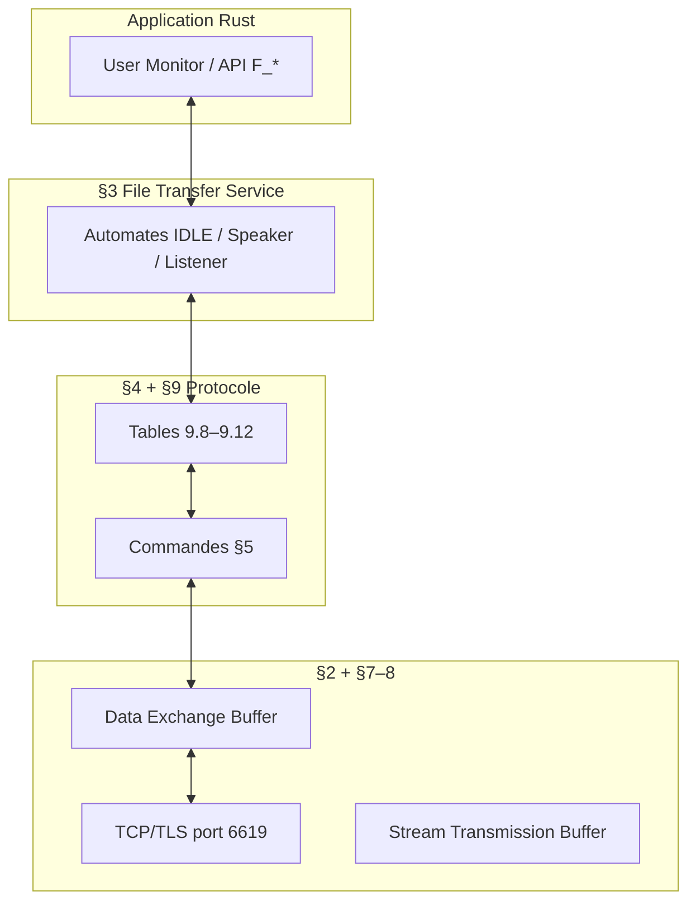

# OFTP2 — Carte mentale (RFC 5024)

## Chapitres RFC → rôle

| § | Note | Rôle pour le projet |
|---|------|---------------------|
| 1 | [[01-rfc5024/01-introduction]] | Concepts, fichiers virtuels, sécurité |
| 2 | [[01-rfc5024/02-reseau-tls]] | TCP, TLS, primitives `N_*` |
| 3 | [[01-rfc5024/03-service-etats]] | API applicative, diagrammes §3.5 |
| 4 | [[01-rfc5024/04-phases-protocole]] | Enchaînement SSID→SFID→DATA→EFID→ESID |
| 5 | [[01-rfc5024/05-commandes-index]] | Formats binaires de chaque PDU |
| 6 | [[01-rfc5024/06-fichiers-crypto]] | CMS, signature, chiffrement, compression |
| 7–8 | [[01-rfc5024/07-08-buffers]] | DEB + en-tête flux |
| 9 | [[01-rfc5024/09-tables/00-vue-ensemble]] | **Implémentation FSM** (9.8–9.12) |
| 10–11 | [[01-rfc5024/10-11-misc-securite]] | Algorithmes, extensions, menaces |

## Deux machines à états (ne pas les confondre)

| Couche | RFC | Visible par l’app ? | Exemple |
|--------|-----|---------------------|---------|
| **Service** | §3.5 | Oui (`F_*`) | `OPENING`, `DATA TRANSFER`, `CLOSING` |
| **Protocole** | §9 | Non (interne) | `IDLESP`, `OPOP`, `WF_RTR`, `WF_CD` |

Le code Rust du **moteur** suit surtout le §9 ; l’**API publique** du crate reflète le §3.

→ [[Rôles client serveur et tables]] pour TCP vs Initiator vs Speaker.

## Rôles dynamiques

- **Initiator / Responder** — qui a ouvert la connexion TCP (§4.2.1)
- **Speaker / Listener** — qui envoie des fichiers *maintenant* (tour, §3.3.4)
- Un même binaire peut être client TCP (initiator) puis listener OFTP après un `CD`

## RFC 2204

À consulter seulement pour « absent en v2 » ou comportement hérité : [[RFCs/rfc2204.txt]].
