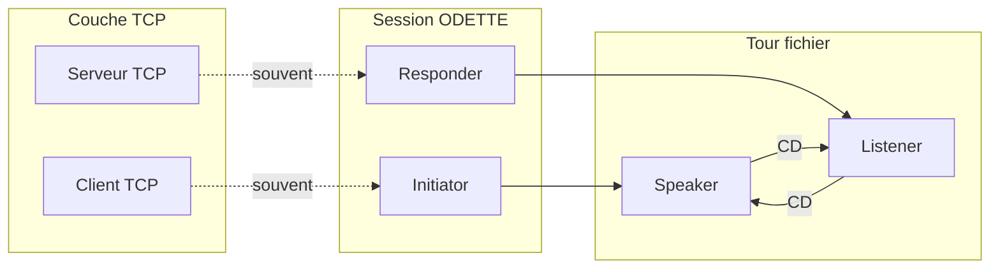

# Rôles : TCP, Initiator/Responder, Speaker/Listener

La RFC **ne parle pas** de « client » / « serveur » ODETTE. En pratique Rust on les mappe ainsi :

## Trois axes indépendants

| Axe | Définition RFC | En Rust typique |
|-----|----------------|-----------------|
| **TCP** | Qui ouvre la socket | `Client::connect` vs `Server::accept` |
| **Initiator / Responder** | Qui a initié la **session ODETTE** (connexion réseau) | Initiator = souvent le client TCP |
| **Speaker / Listener** | Qui **envoie le fichier en cours** | Alterne avec **CD** |

## TCP client / serveur → Initiator / Responder

| Votre rôle | Premier octet ODETTE | États protocole typiques au début | Table §9 |
|------------|----------------------|-----------------------------------|----------|
| **Serveur TCP** (accept) | Envoie **SSRM** | `A_NC_ONLY` → `A_WF_CONRS` → `IDLELI` ou `IDLESP` | [[01-rfc5024/09-tables/9.8-session-connection]] **B**, **E**, **G** |
| **Client TCP** (connect) | Attend **SSRM**, envoie **SSID** | `I_WF_NC` → `I_WF_RM` → `I_WF_SSID` → `IDLESP` / `IDLELI` | **A**, **C**, **H**, **D**, **K** |

Constante locale **`C.Cap-init`** (§9.7) :

- `Initiator` — cette entité **doit** ouvrir TCP (sinon P1 sur `F_CONNECT_RQ`).
- `Responder` — ne doit **pas** initier (P3 sur `N_CON_IND`).
- `Both` — les deux possibles.

## Initiator / Responder ≠ Speaker / Listener

Exemple : client TCP = Initiator, mais après avoir **reçu** un fichier et un **CD**, il devient **Speaker** pour envoyer le sien.

| Rôle session | Peut être Speaker ? | Peut être Listener ? |
|--------------|---------------------|----------------------|
| Initiator | Oui (si mode ≠ Receiver-only) | Oui |
| Responder | Oui | Oui |

**Mode** négocié dans SSID (`S` / `R` / `B`) borne ce que l’**application** peut demander (`F_START_FILE_RQ` interdit si Receiver-only côté Speaker — prédicat P1 table 9.10).

## Quelle table §9 pour quel rôle ?

| Table | S’applique quand… | Client TCP | Serveur TCP |
|-------|-------------------|------------|-------------|
| **9.8** Session | Avant tout fichier | Les deux (chemins différents) | Les deux |
| **9.9** Erreur | Toujours (transversal) | Les deux | Les deux |
| **9.10 + 9.11** Speaker | `IDLESP`, `OPO`, envoi SFID/DATA/EFID/EERP | Quand **vous êtes Speaker** | Idem |
| **9.12** Listener | `IDLELI`, `OPI`, réception | Quand **vous êtes Listener** | Idem |

**Une seule entité** implémente **les quatre tables** ; le rôle actif choisit la table à consulter.

## Quelle PDU en fonction du rôle

| PDU | Émetteur habituel | Récepteur |
|-----|-------------------|-----------|
| SSRM | Responder (serveur TCP) | Initiator |
| SSID | Les deux (échange) | Les deux |
| SFID, DATA, EFID, EERP, NERP, CD | **Speaker** | **Listener** |
| SFPA, SFNA, CDT, EFPA, EFNA, RTR | **Listener** | **Speaker** |
| ESID | Les deux (fermeture) | Les deux |

## États « buffer de requête » (tour pas encore cédé)

Quand l’app envoie une primitive **avant** le **CD** sur le fil :

| État | Primitive stockée dans `V.Req-buf` |
|------|-------------------------------------|
| `SFSTWFCD` | `F_START_FILE_RQ` |
| `ERSTWFCD` | `F_EERP_RQ` |
| `NRSTWFCD` | `F_NERP_RQ` |
| `CDSTWFCD` | `F_CD_RQ` |

Visible surtout côté **Speaker** (table 9.10).

## Liens

- [[01-rfc5024/09-tables/00-vue-ensemble]]
- [[01-rfc5024/03-service-etats]]
- [[02-cas-speciaux/tours-speaker-listener]]
