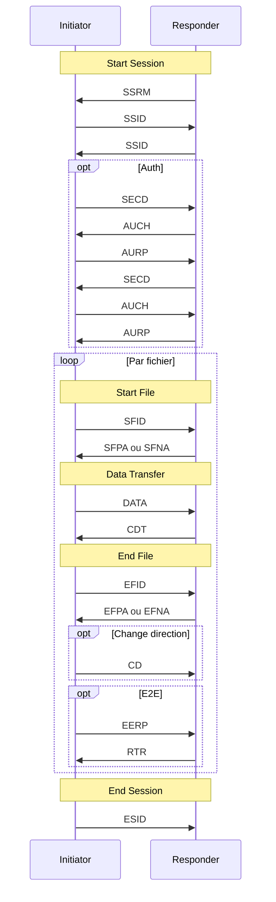

# §4 Protocol Specification

> `RFCs/rfc5024.txt` — §4

## Les 5 phases (§4.1)

Après **End File**, nouvelle phase **Start File** ou **End Session**.

## Commandes (identifiant 1 octet en tête de buffer)

| Cmd | Nom | Phase |
|-----|-----|-------|
| SSRM | Start Session Ready | Session |
| SSID | Start Session | Session |
| SECD/AUCH/AURP | Authentification | Session |
| SFID/SFPA/SFNA | Start File | Fichier |
| DATA/CDT | Données / crédit | Transfert |
| EFID/EFPA/EFNA | End File | Fichier |
| CD | Change Direction | Tour |
| EERP/NERP/RTR | Accusés | Métier |
| ESID | End Session | Fermeture |

Détail formats : [[01-rfc5024/05-commandes-index]].

## §4.2 Start Session

- **Initiator** = celui qui a ouvert TCP.
- **Responder** envoie **en premier** : `SSRM`, puis échange `SSID`.
- Auth optionnelle si négociée (§4.2.3).

## §4.3 Start File

- **SFID** puis **SFPA** ou **SFNA**.
- Restart (§4.3.3), broadcast (§4.3.4), priorité (§4.3.5).
- **EERP/NERP** décrits §4.3.6–7, **RTR** §4.3.8.

## §4.4 Data Transfer

- Buffers **DATA** ; flow control via **CDT** (fenêtre `V.Window`, crédits `Credit_S` / `Credit_L`).

## §4.5–4.6 End File / End Session

- **EFID** → **EFPA** / **EFNA** ; EFPA peut demander **CD**.
- **ESID** termine la session.

## §4.7 Problem Handling

| Sujet | Section |
|-------|---------|
| Erreurs protocole | §4.7.1 → ESID, abort |
| Timers | §4.7.2 → [[02-cas-speciaux/timers]] |
| Clearing centres | §4.7.3 (tiers) |

## Liens

- [[01-rfc5024/09-tables-etats]]
- [[01-rfc5024/05-commandes-index]]

---

## Implémentation

- [ ] `Phase` enum pour logging / métriques
- [ ] Séquenceur qui refuse PDU hors phase (défense en profondeur)
- [ ] Tests par phase avec mocks peer
