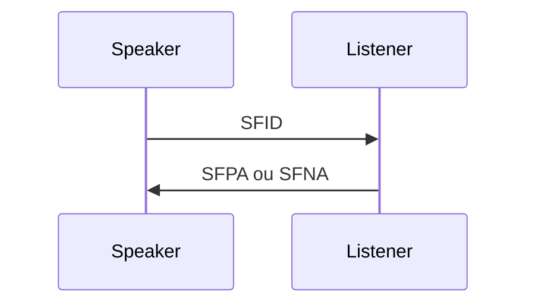

# SFID — Start File

| Propriété | Valeur |
|-----------|--------|
| **Octet 0** | `'H'` |
| **Phase** | Start File |
| **Direction** | **Speaker → Listener** |
| **Tables §9** | Speaker **B**→`OPOP` ; Listener **A**→`OPIP` |

## Rôle client / serveur

Seul le rôle **Speaker** envoie SFID. Un **client TCP** peut être Speaker ou Listener selon le tour (**CD**).

## Structure des champs

| Pos | Champ     | Format  | Description                        |
| --- | --------- | ------- | ---------------------------------- |
| 0   | SFIDCMD   | F X(1)  | `'H'`                              |
| 1   | SFIDDSN   | V X(26) | Nom fichier virtuel                |
| 27  | SFIDRSV1  | F X(3)  | Réservé                            |
| 30  | SFIDDATE  | V 9(8)  | CCYYMMDD                           |
| 38  | SFIDTIME  | V 9(10) | HHMMSScccc                         |
| 48  | SFIDUSER  | V X(8)  | User data                          |
| 56  | SFIDDEST  | V X(25) | Destinataire final (§5.4)          |
| 81  | SFIDORIG  | V X(25) | Originateur                        |
| 106 | SFIDFMT   | F X(1)  | `F`/`V`/`U`/`T`                    |
| 107 | SFIDLRECL | V 9(5)  | Longueur max enreg. (0 si T/U)     |
| 112 | SFIDFSIZ  | V 9(13) | Taille transmise en blocs 1K       |
| 125 | SFIDOSIZ  | V 9(13) | Taille originale en blocs 1K       |
| 138 | SFIDREST  | V 9(17) | Position restart                   |
| 155 | SFIDSEC   | F 9(2)  | 00–03 sécurité fichier             |
| 157 | SFIDCIPH  | F 9(2)  | Suite crypto                       |
| 159 | SFIDCOMP  | F 9(1)  | 0=non, 1=ZLIB                      |
| 160 | SFIDENV   | F 9(1)  | Enveloppe CMS                      |
| 161 | SFIDSIGN  | F X(1)  | EERP signé Y/N                     |
| 162 | SFIDDESCL | V 9(3)  | Longueur description UTF-8         |
| 165 | SFIDDESC  | V T(n)  | Description (max 999 octets UTF-8) |

## Restart

- Format **F/V** : numéro d’enregistrement.
- Format **U/T** : offset en blocs 1K.
- Fichier chiffré/signé traité en **U** pour restart (§5.3.3).

## Enchaînement

Réponses : [[SFPA]] · [[SFNA]]

## Transitions clés

| Côté | Event | Code | → État |
|------|-------|------|--------|
| Speaker | `F_START_FILE_RQ` | B | OPOP |
| Listener | SFID | A | OPIP + `F_START_FILE_IND` |

---

## OFTP1 vs OFTP2

| Champ      | OFTP1                    | OFTP2                                                   |
| ---------- | ------------------------ | ------------------------------------------------------- |
| `SFIDRSV1` | 9 octets                 | **3** octets                                            |
| `SFIDDATE` | `YYMMDD` (6)             | **`CCYYMMDD` (8)**                                      |
| `SFIDTIME` | `HHMMSS` (6)             | **`HHMMSScccc` (10)**                                   |
| `SFIDFSIZ` | 7 chiffres (max ~10⁷ Ko) | **13 chiffres** (fichier transmis)                      |
| `SFIDOSIZ` | ❌ absent                 | **13 chiffres** (taille fichier **original** avant CMS) |
| `SFIDREST` | 9 chiffres               | **17 chiffres**                                         |
| `SFIDSEC`  | ❌                        | **00–03** (aucun / chiffré / signé / les deux)          |
| `SFIDCIPH` | ❌                        | Suite crypto (CMS)                                      |
| `SFIDCOMP` | ❌                        | Compression fichier (0=non, 1=ZLIB)                     |
| `SFIDENV`  | ❌                        | Enveloppe CMS                                           |
| `SFIDSIGN` | ❌                        | EERP signé **Y/N**                                      |
| `SFIDDESC` | ❌                        | Description **UTF-8** variable                          |

**Interop** : un SFID v2 est **plus long** ; un parser v1 ne peut pas recevoir les champs sécurité. Fichier signé/chiffré traité en format **`U`** pour restart même si source F/V.

**Codes SFNA v2** liés : 14–20 (direction, cipher, crypto, compression, signature).

## Implémentation

- [ ] Builder depuis `VirtualFile`
- [ ] Valider SFIDFMT vs SFIDLRECL
- [ ] Mapper vers transitions 9.10 B / 9.12 A
