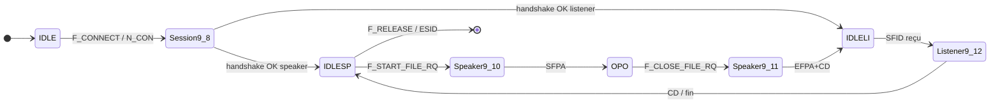

# §9 — Vue d’ensemble des tables d’états

> Source : `RFCs/rfc5024.txt` §9

## Les 5 tables et leur rôle

| Table | Fichier | Couvre les états | Sert à… |
|-------|---------|------------------|---------|
| **9.8** | [[9.8-session-connection]] | `IDLE` … `IDLESP`/`IDLELI`, auth | **Ouvrir/fermer la session** (TCP déjà là → SSRM/SSID → prêt à échanger des fichiers) |
| **9.9** | [[9.9-error-abort]] | `IDLE`, `I_WF_NC`, `WF_NDISC` + *tous* via ESID/abort | **Urgence** : timeout, reset TCP, buffer invalide, `F_ABORT_RQ` |
| **9.10** | [[9.10-speaker-1]] | `IDLESP` … `OPOWFC`, `WF_*` | **Speaker** : ouvrir fichier, DATA, CD, EERP/NERP, release |
| **9.11** | [[9.11-speaker-2]] | `OPO`, `OPOWFC`, `CLOP` | **Speaker** : clôture fichier (EFID), réaction EFPA/EFNA |
| **9.12** | [[9.12-listener]] | `IDLELI` … `RTRP` | **Listener** : accepter SFID, DATA, EFID, EERP/NERP, RTR |

## Lecture d’une cellule dans la RFC

Dans les matrices §9.8–9.12 :

- **Lignes** = événements **entrants** (primitive `F_*`, PDU pair, `N_*`, timer).
- **Colonnes** = état **courant** de l’entité.
- **Lettre** (A, B, C…) = clé dans la **table de transitions** (§9.x.**2**) du même paragraphe.
- Colonne **Actions** (ex. `4,2,5`) = numéros définis en §9.x.**3** → [[00-actions-et-predicats]].
- **C** = souvent « protocol error » → ESID + abort (table 9.10).
- **U** = User Error (primitive inattendue pour cet état).
- **S** = état terminal / no-op vers `WF_NDISC`.

## Enchaînement typique (les deux côtés)

## Client TCP vs serveur TCP

Voir [[00-index/Rôles client serveur et tables]] — la table **9.8** est la seule asymétrique au démarrage ; **9.10–9.12** dépendent du **Speaker/Listener**, pas du client TCP.

## Index des états (§9.3)

Liste complète avec colonnes **Entité**, **Initiator/Responder**, **TCP typique** : [[../09-tables-etats#9.3 — États protocole]].

## Vérification « tables complètes »

Les notes `9.8` … `9.12` reprennent **intégralement** les matrices et transitions de la RFC 5024 (novembre 2007). En cas de doute, `RFCs/rfc5024.txt` fait foi.
