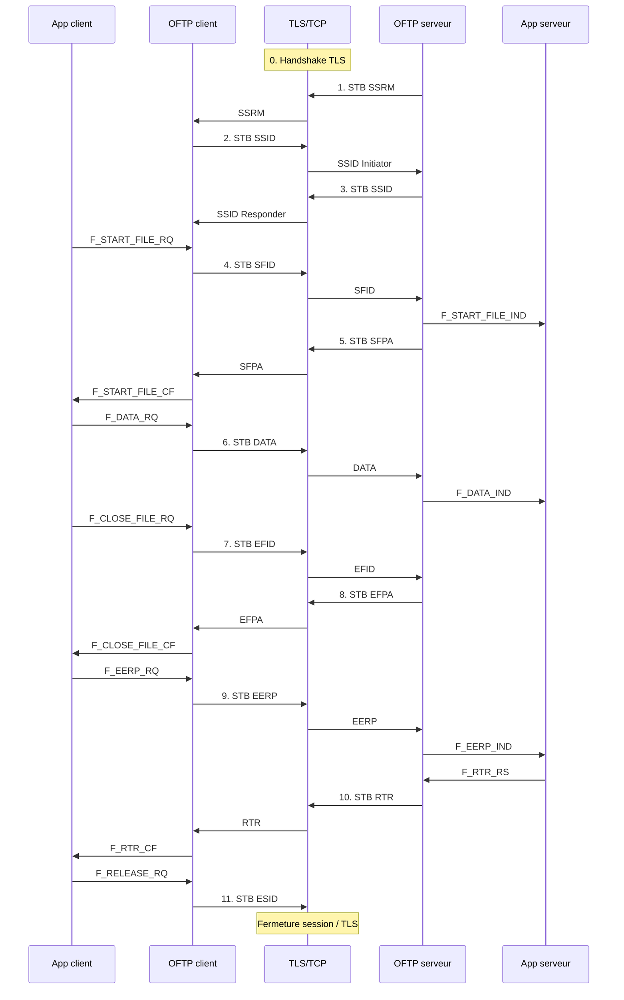

# Exemple complet — `hello.txt` (« HELLO WORLD »)

Scénario pédagogique : **client TCP** envoie un fichier texte au **serveur TCP**, échange **OFTP2** classique sur **TLS** (port **6619**), sans auth mutuelle CMS, sans compression buffer ni fichier.

## Hypothèses du scénario

| Paramètre                 | Valeur retenue                                                   |
| ------------------------- | ---------------------------------------------------------------- |
| Fichier                   | `hello.txt`, contenu ASCII `HELLO WORLD` (**11** octets)         |
| Format virtuel            | **`U`** (non structuré, binaire/texte brut)                      |
| Client                    | TCP **Initiator**, devient **Speaker** pour l’envoi              |
| Serveur                   | TCP **Responder**, **Listener** pendant le fichier               |
| TLS                       | Négocié **avant** le premier octet ODETTE                        |
| `SSIDSDEB` / `V.Buf-size` | **2048** (min des deux)                                          |
| `SSIDCRED` / `V.Window`   | **50** (pas de **CDT** : un seul DATA)                           |
| `SSIDCMPR`                | **N** (pas de bit CF)                                            |
| `SSIDAUTH`                | **N** (pas de **SECD** / **AUCH** / **AURP**)                    |
| `SFIDSIGN`                | **N** (EERP sans hash ni signature CMS)                          |
| `SFIDCOMP`                | **0** (pas de zlib fichier)                                      |
| Identifiants              | Client `CLIENT01` / serveur `SERVER01` (25 car. + espaces, §5.4) |

> Les champs date/heure, dest/orig sont **exemples** ; en prod ils suivent l’accord bilatéral.

## Vue d’ensemble (séquence)



**Nombre de STB sur le fil** (couche TCP) : **11** paquets applicatifs ODETTE (hors TLS handshake).

---

## Rappel STB (chaque PDU sauf note contraire)

Sur TCP, **tout** exchange buffer (y compris **DATA**) est envoyé ainsi :

```
STB = STH (4 o) + OEB
```

| Champ STH | Valeur (exemple) |
|-----------|------------------|
| Version + Flags | `0x10` (version 1, flags 0) |
| Length | Taille **totale** STB = `4 + len(OEB)` (big-endian, 24 bits utiles) |

Exemple : OEB de **13** octets → Length = **17** → STH hex : `10 00 00 11`.

---

## Paquet 0 — TLS (hors RFC §5, mais réalité OFTP2)

| Direction | Contenu |
|-----------|---------|
| Client → Serveur | `ClientHello` … |
| Serveur → Client | `ServerHello`, certificat, … |
| Les deux | `Finished` |

Ensuite seulement les **STB** ci-dessous.

---

## Paquet 1 — SSRM (Serveur → Client)

| | |
|--|--|
| **PDU** | [[../01-rfc5024/05-commandes/SSRM]] |
| **Rôle** | Responder annonce « ODETTE prêt » |
| **État serveur** | Après `N_CON_IND` → transition **B** |
| **État client** | Reçoit → quitte `I_WF_RM` |

**OEB** (19 octets) :

```text
'I' + "ODETTE FTP READY " + CR(0x0D)
```

| Hex (OEB) | ASCII |
|-----------|--------|
| `49` | `I` |
| `4F 44 45 54 54 45 20 46 54 50 20 52 45 41 44 59 20` | `ODETTE FTP READY ` |
| `0D` | CR |

**STB** : Length = 4 + 19 = **23** → `10 00 00 17` + OEB.

---

## Paquet 2 — SSID (Client → Serveur)

| | |
|--|--|
| **PDU** | [[../01-rfc5024/05-commandes/SSID]] |
| **Rôle** | Initiator présente capacités |
| **État client** | `I_WF_SSID` → envoi |

**OEB** (61 octets) — champs principaux :

| Champ | Exemple |
|-------|---------|
| `SSIDCMD` | `'X'` |
| `SSIDLEV` | `'5'` (OFTP2) |
| `SSIDCODE` | `CLIENT01` + padding espaces → 25 car. |
| `SSIDPSWD` | 8 car. (mot de passe bilatéral) |
| `SSIDSDEB` | `02048` → buf 2048 |
| `SSIDSR` | `B` (send + receive) |
| `SSIDCMPR` | `N` |
| `SSIDREST` | `N` |
| `SSIDSPEC` | `N` |
| `SSIDCRED` | `050` |
| `SSIDAUTH` | `N` |
| `SSIDCR` | `0x0D` |

**STB** : Length = 4 + 61 = **65**.

---

## Paquet 3 — SSID (Serveur → Client)

| | |
|--|--|
| **PDU** | SSID (réponse Responder) |
| **Effet** | `V.Buf-size = min(2048,2048)`, `V.Window = min(50,50)`, `V.Compression = N` |
| **États** | Client **D** → `IDLESP` ; Serveur **G** → `IDLELI` |

Même structure 61 octets avec `SSIDCODE` = `SERVER01` … (côté serveur, le champ code identifie le **Responder**).

Pas de **SECD** car `SSIDAUTH=N` des deux côtés.

---

## Paquet 4 — SFID (Client → Serveur)

|                |                                                     |
| -------------- | --------------------------------------------------- |
| **PDU**        | [[../01-rfc5024/05-commandes/SFID]]                 |
| **Rôle**       | Speaker ouvre le fichier virtuel                    |
| **Signal app** | `F_START_FILE_RQ` → protocole **B** → état **OPOP** |
| **Serveur**    | **A** → **OPIP** + `F_START_FILE_IND`               |

**OEB** (165 octets si `SFIDDESCL=000`) — valeurs d’exemple :

| Champ                   | Valeur                                      |
| ----------------------- | ------------------------------------------- |
| `SFIDCMD`               | `'H'`                                       |
| `SFIDDSN`               | `hello.txt` + espaces (26)                  |
| `SFIDDATE`              | `20260601`                                  |
| `SFIDTIME`              | `1200000001`                                |
| `SFIDFMT`               | **`U`**                                     |
| `SFIDLRECL`             | `00000`                                     |
| `SFIDFSIZ` / `SFIDOSIZ` | `0000000000001` (1 bloc KiB ; fichier ≪ 1K) |
| `SFIDREST`              | `00000000000000000`                         |
| `SFIDSEC`               | `00`                                        |
| `SFIDCIPH`              | `00`                                        |
| `SFIDCOMP`              | `0`                                         |
| `SFIDENV`               | `0`                                         |
| `SFIDSIGN`              | `N`                                         |
| `SFIDDESCL`             | `000` (pas de description UTF-8)            |

**STB** : Length = 4 + 165 = **169**.

---

## Paquet 5 — SFPA (Serveur → Client)

| | |
|--|--|
| **PDU** | [[../01-rfc5024/05-commandes/SFPA]] |
| **Rôle** | Listener accepte le fichier |
| **Transition client** | **K** → `F_START_FILE_CF`, **`Credit_S = Window` (50)**, état **OPO** |

**OEB** (18 octets) :

| Champ | Valeur |
|-------|--------|
| `SFPACMD` | `'2'` |
| `SFPAACNT` | `00000000000000000` (pas de restart) |

**STB** : Length = **22**.

---

## Paquet 6 — DATA (Client → Serveur) — cœur du fichier

| | |
|--|--|
| **PDU** | [[../01-rfc5024/05-commandes/DATA]] |
| **Rôle** | Transfert des octets fichier |
| **Signal app** | `F_DATA_RQ` → **M** ; `Credit_S` : 50 → **49** |
| **Serveur** | **I** → `F_DATA_IND` (pas de **CDT** : crédit encore > 0) |

### Contenu fichier

```text
HELLO WORLD
```

| Octet | Hex |
|-------|-----|
| H | `48` |
| E | `45` |
| L | `4C` |
| L | `4C` |
| O | `4F` |
| (space) | `20` |
| W | `57` |
| O | `4F` |
| R | `52` |
| L | `4C` |
| D | `44` |

### Construction `DATABUF` (format U, un enregistrement)

Un seul subrecord, **EOR=1** (fin d’enregistrement = fin de fichier non structuré) :

| Champ | Calcul | Valeur |
|-------|--------|--------|
| EOR | bit 0 = 1 | `0x80` |
| CF | 0 | `0x00` |
| COUNT | 11 | `0x0B` |
| **HDR** | `0x80 \| 0x0B` | **`0x8B`** |
| Payload | 11 octets ASCII | `48 45 4C 4C 4F 20 57 4F 52 4C 44` |

**OEB** = `'D'` + DATABUF → **13** octets :

```hex
44 8B 48 45 4C 4C 4F 20 57 4F 52 4C 44
 D  Hdr  H  E  L  L  O     W  O  R  L  D
```

**STB** : Length = 4 + 13 = **17** → STH `10 00 00 11` + OEB.

> Même un fichier minuscule passe par **HDR + subrecord** ; ce n’est pas `D` suivi directement des 11 octets.

---

## Paquet 7 — EFID (Client → Serveur)

|               |                                     |
| ------------- | ----------------------------------- |
| **PDU**       | [[../01-rfc5024/05-commandes/EFID]] |
| **Rôle**      | Speaker signale fin de fichier      |
| **Prérequis** | État **OPO** (pas **OPOWFC**)       |
| **Effet**     | `Credit_S = 0` (Action 7)           |

**OEB** (35 octets) :

| Champ | Valeur |
|-------|--------|
| `EFIDCMD` | `'T'` |
| `EFIDRCNT` | `00000000000000000` (format **U** → zéros) |
| `EFIDUCNT` | `00000000000000011` (**11** octets unité) |

**STB** : Length = **39**.

---

## Paquet 8 — EFPA (Serveur → Client)

| | |
|--|--|
| **PDU** | [[../01-rfc5024/05-commandes/EFPA]] |
| **Rôle** | Listener confirme réception fichier |
| **Transition client** | **C** avec `EFPACD=N` → `F_CLOSE_FILE_CF`, état **IDLESP** |

**OEB** (2 octets) :

| Champ | Valeur |
|-------|--------|
| `EFPACMD` | `'4'` |
| `EFPACD` | **`N`** (pas de demande **CD** immédiate) |

**STB** : Length = **6**.

Le client reste prêt à envoyer **EERP** (toujours Speaker pour l’accusé métier).

---

## Paquet 9 — EERP (Client → Serveur)

| | |
|--|--|
| **PDU** | [[../01-rfc5024/05-commandes/EERP]] |
| **Rôle** | Accusé de réception **bout en bout** (couche métier) |
| **Signal app** | `F_EERP_RQ` → **A** → **WF_RTR** |

**OEB** (110 octets si pas de hash ni signature) :

| Champ                   | Valeur / note                            |
| ----------------------- | ---------------------------------------- |
| `EERPCMD`               | `'E'`                                    |
| `EERPDSN`               | `hello.txt` (comme SFID)                 |
| `EERPDATE` / `EERPTIME` | Reprendre SFID                           |
| `EERPDEST`              | **Origine** du fichier (inversé vs SFID) |
| `EERPORIG`              | **Destinataire final** (inversé vs SFID) |
| `EERPHSHL`              | `00 00` (longueur hash = 0)              |
| `EERPSIGL`              | `00 00` (non signé)                      |

**STB** : Length = 4 + 110 = **114**.

---

## Paquet 10 — RTR (Serveur → Client)

|                |                                                                                        |
| -------------- | -------------------------------------------------------------------------------------- |
| **PDU**        | [[../01-rfc5024/05-commandes/RTR]]                                                     |
| **Rôle**       | Listener a traité l’EERP ; Speaker peut continuer                                      |
| **Signal app** | Après `F_RTR_RS` côté serveur → envoi **RTR** ; client **N** → `F_RTR_CF` → **IDLESP** |

**OEB** (1 octet) : `'P'`

**STB** : Length = **5** → STH `10 00 00 05` + `50`.

---

## Paquet 11 — ESID (Client → Serveur)

|                |                                     |
| -------------- | ----------------------------------- |
| **PDU**        | [[../01-rfc5024/05-commandes/ESID]] |
| **Rôle**       | Fin de session normale              |
| **Signal app** | `F_RELEASE_RQ`                      |

**OEB** (exemple minimal, texte raison vide) :

| Champ       | Valeur             |
| ----------- | ------------------ |
| `ESIDCMD`   | `'F'`              |
| `ESIDREAS`  | `00` (fin normale) |
| `ESIDREASL` | `000`              |
| `ESIDCR`    | `0x0D`             |

**STB** : Length = 4 + 7 = **11** (sans `ESIDREAST`).

Le serveur monte `F_RELEASE_IND` / fermeture ; **`N_DISC_RQ`** côté TCP.

---

## Tableau récapitulatif des PDU

| # | Direction | CMD | OEB (o) | STB (o) | Phase |
|---|-----------|-----|---------|---------|--------|
| 0 | — | TLS | — | — | Transport |
| 1 | S→C | `I` | 19 | 23 | Start session |
| 2 | C→S | `X` | 61 | 65 | Start session |
| 3 | S→C | `X` | 61 | 65 | Start session |
| 4 | C→S | `H` | 165 | 169 | Start file |
| 5 | S→C | `2` | 18 | 22 | Start file |
| 6 | C→S | `D` | **13** | **17** | Data |
| 7 | C→S | `T` | 35 | 39 | End file |
| 8 | S→C | `4` | 2 | 6 | End file |
| 9 | C→S | `E` | 110 | 114 | EERP |
| 10 | S→C | `P` | 1 | 5 | RTR |
| 11 | C→S | `F` | 7 | 11 | End session |

**Octets fichier utiles sur le réseau** (dans paquet 6 uniquement) : **11**.  
**Overhead OFTP applicatif** (somme OEB paquets 1–11) : **492** octets (hors TLS) — normal pour un tout petit fichier.

---

## Variantes non montrées ici

| Situation | PDU / comportement supplémentaire |
|-----------|-----------------------------------|
| Fichier > fenêtre crédit | Plusieurs **DATA**, puis **CDT** (Listener) entre les vagues |
| `EFPACD=Y` | **CD** (`R`) après EFPA pour céder le tour |
| `SSIDAUTH=Y` | **SECD**, **AUCH**, **AURP** avant SFID |
| `SSIDCMPR=Y` | Subrecords **CF=1** sur runs d’octets identiques |
| Erreur fichier | **SFNA** / **EFNA** à la place de SFPA / EFPA |
| Rejet métier | **NERP** au lieu de **EERP** |

---

## Liens

- [[../01-rfc5024/05-commandes/DATA]] — subrecords, capacité, STB
- [[../00-index/Rôles client serveur et tables]] — Initiator / Speaker
- [[tours-speaker-listener]] — **CD** et alternance
- [[eerp-nerp]] — détail EERP / NERP
- RFC 5024 Appendix A — autre exemple encodage §7 (*Ancient Mariner*)

## Implémentation / tests

- [ ] Rejouer les 11 STB avec un captureur (Wireshark decrypt TLS si clés dispo)
- [ ] Test unitaire : encoder paquet 6 et vérifier `44 8B 48…`
- [ ] Test intégration : comparer séquence d’états §9.8 → 9.10 → 9.11 → 9.12
